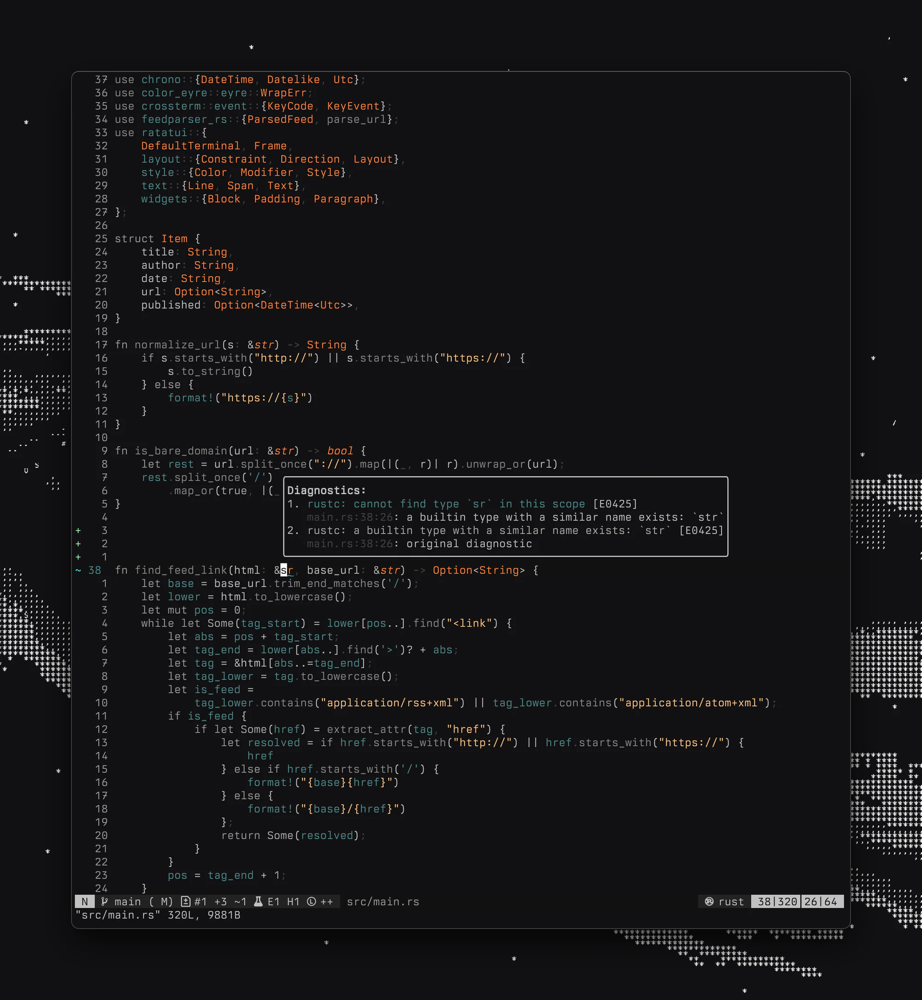

<h3 align="center">
	<br/>
	
	darkmatter.nvim
	
</h3>

<p align="center">
	
</p>

A colorscheme adapted from base16-black-metal-bathory. Works in both Neovim and Vim 8+.

## Features

- Works in Neovim and Vim from a single `colorscheme darkmatter`
- Support for Neovim's built-in LSP
- Treesitter highlighting
- Plugin integrations:
  - Telescope
  - Indent Blankline
  - Nvim-notify
  - Rainbow parentheses
  - Nvim-cmp
  - vim-illuminate
  - LSP semantic tokens
  - mini.completion
  - nvim-dap-ui
- 256-color terminal fallback for Vim without `termguicolors`

## Installation

### Using [packer.nvim](https://github.com/wbthomason/packer.nvim)

```lua
use {
  'darkmattertheme/nvim',
  config = function()
    vim.cmd('colorscheme darkmatter')
  end
}
```

### Using [lazy.nvim](https://github.com/folke/lazy.nvim)

```lua
{
  'darkmattertheme/nvim',
  lazy = false,
  priority = 1000,
  config = function()
    vim.cmd('colorscheme darkmatter')
  end,
}
```

### Vim

Using [vim-plug](https://github.com/junegunn/vim-plug):

```vim
Plug 'darkmattertheme/nvim'
```

Or with Vim's built-in package support:

```sh
git clone https://github.com/darkmattertheme/nvim \
  ~/.vim/pack/plugins/start/darkmatter.nvim
```

## Usage

Set the colorscheme in your Neovim configuration:

```lua
vim.cmd('colorscheme darkmatter')
```

Or in your `.vimrc`:

```vim
colorscheme darkmatter
```

If you don't see colors, make sure you have true color support enabled:

```lua
vim.opt.termguicolors = true
```

```vim
set termguicolors
```

Vim will fall back to the nearest 256-color approximations if `termguicolors`
is off or unsupported.

## Configuration

The plugin integrations are Neovim-only. You can configure them by passing
options to the setup function:

```lua
require('darkmatter-colorscheme').setup(require('colors.darkmatter'), {
  -- All options default to true
  telescope = true,          -- Telescope plugin
  telescope_borders = false, -- Telescope borders
  indentblankline = true,    -- Indent-blankline plugin
  notify = true,             -- Nvim-notify plugin
  ts_rainbow = true,         -- Rainbow parentheses
  cmp = true,                -- Nvim-cmp plugin
  illuminate = true,         -- vim-illuminate plugin
  lsp_semantic = true,       -- LSP semantic tokens
  mini_completion = true,    -- mini.completion plugin
  dapui = true,              -- nvim-dap-ui plugin
})
```

Note that `setup()` takes the palette as its first argument and the options
table as its second.

## Credits

This colorscheme is based on the base16-black-metal-bathory palette and was inspired by various dark themes in the Neovim ecosystem, and the base for this plugin is pulled from [base16-nvim](https://github.com/RRethy/base16-nvim)
